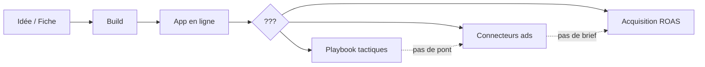
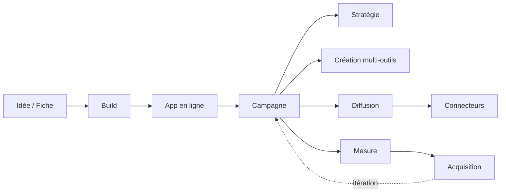

# Cadrage produit — Module Campagne (cockpit)

> Document de travail — juin 2026  
> Statut : **refonte stade-aware (juin 2026)** — voir implémentation `src/lib/campaign/stages.ts`  
> Objectif : co-pilote d'acquisition founder-led (0→100), 5 étapes : Cible → Message → Préparer → Agir → Suivre.

## Refonte juin 2026 (résumé)

- **Stades** (`network` → `scale`) remplacent les profils budget comme pilote principal.
- **Parcours 5 phases** avec objectif SMART, plan d'actions cochable, check-ins hebdo, rétrospective.
- **Acquisition** reste le dashboard ROAS/funnel (stade `scale`).
- Ancien modèle 3 étapes / `MarketingProfile` conservé en compat migration JSON.

---

## Table des matières

1. [Vision & positionnement](#1-vision--positionnement)
2. [Cartographie de l'existant (ce qu'on ne touche pas)](#2-cartographie-de-lexistant)
3. [Le trou produit](#3-le-trou-produit)
4. [Personas & parcours utilisateur](#4-personas--parcours-utilisateur)
5. [Architecture module](#5-architecture-module)
6. [Modèle de données](#6-modèle-de-données)
7. [Registre d'outils marketing](#7-registre-doutils-marketing)
8. [Parcours Campagne (4 étapes)](#8-parcours-campagne-4-étapes)
9. [Campaign Kit (équivalent BuildSetup)](#9-campaign-kit)
10. [Workflows série / parallèle](#10-workflows-série--parallèle)
11. [Écrans & composants](#11-écrans--composants)
12. [Intégrations transverses](#12-intégrations-transverses)
13. [API & génération IA](#13-api--génération-ia)
14. [Règles anti-pollution](#14-règles-anti-pollution)
15. [Phasing & critères de succès](#15-phasing--critères-de-succès)
16. [Annexes](#16-annexes)

---

## 1. Vision & positionnement

### Promesse

**Campagne = le Build du go-to-market.**

Build répond à : *« Avec quel outil et quel prompt je construis mon SaaS ? »*  
Campagne répond à : *« Avec quels outils et quels briefs je lance ma campagne d'acquisition ? »*

### Ce que le module fait

- **Orchestrer** des outils externes (Higgsfield, Creatify, Claude, Lemlist…), pas les remplacer.
- **Générer** des kits actionnables (briefs, prompts, checklists) depuis la fiche opportunité / idée.
- **Guider** un parcours en 4 étapes, avec multi-outils en série ou parallèle.
- **Relier** aux connecteurs existants pour fermer la boucle mesure (Acquisition).

### Ce que le module ne fait pas

| Hors périmètre | Où ça vit déjà |
|----------------|----------------|
| Mesurer ROAS, funnel, dépenses | Module **Acquisition** (pilotage) |
| Stocker credentials, sync API | Module **Connecteurs** |
| Stratégie marché statique, CAC, tactiques | **Modèle / Idée** (playbook, onglet Clients) |
| Onboarding premiers jalons build | **LaunchPad** (pré-cockpit) |
| Générer le code produit | Module **Build** |

### Nom & identité cockpit

| Élément | Valeur proposée |
|---------|-----------------|
| `CockpitModuleId` | `campagne` |
| Label sidebar | **Campagne** |
| Icône | `Megaphone` (déjà utilisée par Acquisition — **à remplacer sur Acquisition** par `TrendingUp` ou `BarChart2` pour éviter collision visuelle) |
| Groupe nav | `COCKPIT_PROJET` — entre Build et Modèle/Idée |
| URL | `/cockpit/[id]?module=campagne` |
| Description | « Stack marketing, kits IA et lancement guidé » |

---

## 2. Cartographie de l'existant

### Modules cockpit actuels

```
Tableau de bord (overview)
│
├── PROJET
│   ├── Build          → construction produit
│   ├── Modèle / Idée  → fiche stratégique (lecture)
│   └── [Campagne]     → ← NOUVEAU
│
└── PILOTAGE
    ├── Connecteurs
    ├── Produit
    ├── Revenus
    ├── Acquisition    → métriques campagnes (lecture + saisie manuelle)
    ├── Finance
    ├── Clients
    └── Rapports
```

### LaunchPad ≠ Campagne

Le **LaunchPad** (`shouldShowLaunchPad` → `onboardingCompleted !== true`) est l'écran d'entrée **avant** le cockpit complet. Il gère :

- 3 jalons onboarding (`ONBOARDING_MILESTONE_TARGET = 3`)
- Semaine 1 du `launchTimeline` opportunité
- Liens vers Build et playbook drawer

**Décision :** LaunchPad reste inchangé. Campagne s'active **après** Build (app en ligne) ou manuellement. Pas de fusion.

### Playbook — onglet Clients / AcquisitionSection

`AcquisitionSection` (dans playbook, tab Clients) fournit :

- Canaux recommandés + tactiques (`opportunity.acquisition[]`)
- Table CAC (`cacChannels`)
- Générateurs texte (`acquisition-content.ts`) : prompt / email / message LinkedIn
- Templates email (`emailTemplates`)
- Lien « Voir Acquisition » → module pilotage

**Décision :** Playbook reste la **référence stratégique**. Campagne **consomme** ces données, ne les duplique pas. Un bandeau contextuel dans Campagne renvoie au playbook pour le « pourquoi », Campagne pour le « comment faire ».

### Module Acquisition (pilotage)

- `CampaignTable` — saisie manuelle `AdCampaign`
- Graphiques ROAS, funnel depuis connecteurs
- Callouts alertes budget

**Décision :** Acquisition ne bouge pas. Campagne ajoute un **CTA sortant** en étape 4 : « Voir les résultats dans Acquisition ». Les callouts Acquisition existants restent ; on ajoute des callouts **entrants** vers Campagne (ex. « Connecteur ads actif mais aucun kit campagne »).

### Connecteurs pertinents

| Connecteur | Rôle dans Campagne | Étape |
|------------|-------------------|-------|
| LinkedIn Ads, TikTok Ads, Google Ads, Meta Ads | Diffusion payante | 3 — Diffusion |
| Plausible, GA, PostHog | Mesure trafic / signups | 4 — Mesure |
| Loops, Brevo | Email nurturing | 3 — Diffusion |
| HubSpot, Pipedrive | Outreach B2B (futur) | 3 |

Campagne **ne duplique pas** les flows OAuth — il deep-link vers Connecteurs avec `?connector=linkedin-ads` ou utilise `onConnectIntegration` via props existantes.

### Données opportunité consommées

| Champ | Usage Campagne |
|-------|----------------|
| `acquisition[]` | Canaux prioritaires, tactiques par canal |
| `cacChannels[]` | Budget indicatif par canal |
| `emailTemplates[]` | Seed séquences email (étape Création) |
| `launchTimeline[]` | Calendrier semaines (optionnel, phase 2) |
| `targetClient`, `sector` | Personas dans brief |
| `financialScenarios` | Prix, MRR cible pour messaging |
| `foreignMarketProfile` | Angle problème / différenciation |
| `ideaBrief.*` (projets idée) | Même mapping via `resolveCockpitOpportunity` |

### Champs projet déjà présents (réutilisation)

| Champ `UserProject` | Réutilisation |
|---------------------|---------------|
| `phase: "launch"` | Passage auto `build` → `launch` quand Build `displayPhase === "live"` |
| `launchChecklistDone?: number[]` | **Checklist assets Campagne** (indices 0–N) |
| `launchRoomSeenAt` | Déprécier ou réutiliser comme `campagneSeenAt` |
| `campaigns?: AdCampaign[]` | Inchangé — alimenté par Acquisition, lu en étape 4 |
| `productName` | Injecté dans tous les kits |
| `hostConnection.productionUrl` | Prérequis étape 1 (landing live) |

---

## 3. Le trou produit

### Parcours actuel (sans Campagne)



L'utilisateur atterrit sur des **îlots** : tactiques dans le playbook, connecteurs dans Integrations, métriques dans Acquisition. Aucun fil conducteur « je lance ma première campagne cette semaine ».

### Parcours cible (avec Campagne)



### Moment de déclenchement

| Signal | Action UI |
|--------|-----------|
| `getBuildJourneyState().displayPhase === "live"` | Bandeau Build : « Passez à Campagne » |
| `project.phase === "launch"` + pas de `campaignKit` | Module Campagne suggéré dans overview |
| Connecteur ads connecté + 0 campagne | Callout Acquisition → Campagne |
| Utilisateur clique sidebar Campagne | Toujours accessible (pas de hard gate) |

**Pas de hard gate** : un fondateur peut ouvrir Campagne avant d'avoir fini Build (ex. préparer cold email en parallèle). Le stepper affiche un avertissement doux, pas un mur.

---

## 4. Personas & parcours utilisateur

### Persona A — « Bootstrapped » (80 % de la cible)

- Solo, budget < 100 €/mois outils
- Canaux : LinkedIn organique, cold email, SEO léger
- Outils : Claude + Canva + Lemlist + Plausible
- Parcours : **série** (stratégie → copy → outreach → mesure)

### Persona B — « Growth » 

- Budget 200–500 €/mois
- Canaux : Meta/TikTok ads + UGC vidéo
- Outils : Creatify/Higgsfield + AdCreative + connecteurs ads
- Parcours : **parallèle** (3 vidéos UGC + 5 statics + ads en même temps)

### Persona C — « B2B niche »

- Cible métier précise (ex. cabinets dentaires)
- Canaux : LinkedIn Ads + cold email + partenariats
- Outils : Apollo + Claude + LinkedIn Ads connector
- Parcours : **série** avec étape outreach longue

### Profil marketing (`MarketingProfile`)

Équivalent de `BuildDevLevel` :

| Profil | Label | Description |
|--------|-------|-------------|
| `organic` | Organique | Pas de budget pub — contenu, email, SEO |
| `paid-light` | Pub légère | 50–200 €/mois — tests créas + 1 canal ads |
| `paid-scale` | Pub scale | 200 €+ — multi-canal, UGC vidéo, batch créas |

Recommandation auto depuis `opportunity.acquisition[0]` + `cacChannels[0].estimate` :

- CAC < 50 € → `organic`
- CAC 50–150 € → `paid-light`
- CAC > 150 € → `paid-scale`

### User stories prioritaires

| # | En tant que… | Je veux… | Afin de… |
|---|--------------|----------|----------|
| US-1 | fondateur post-build | voir mon canal recommandé et un plan semaine 1 | ne pas réfléchir par où commencer |
| US-2 | fondateur | choisir plusieurs outils (Claude + Creatify) pour la même campagne | couvrir copy + vidéo en parallèle |
| US-3 | fondateur | copier un prompt prêt pour Creatify/Higgsfield | produire une vidéo UGC en 10 min |
| US-4 | fondateur | cocher les assets produits (landing, 3 posts, 1 vidéo) | suivre ma progression |
| US-5 | fondateur | connecter LinkedIn Ads depuis Campagne | lancer sans quitter le parcours |
| US-6 | fondateur | voir si mon ROAS remonte dans Acquisition | boucler itération créative |
| US-7 | fondateur idée | avoir un kit campagne depuis mon `ideaBrief` | même expérience que catalogue |

### Parcours détaillé — Persona A (cold email B2B)

```
Jour 0 — Projet créé, Build terminé, URL live
  └─ Overview callout : « Votre app est en ligne — lancez votre campagne »
  └─ Clic → Campagne, étape 1

Étape 1 — Stratégie (15 min)
  └─ Canal pré-sélectionné : Cold email (depuis fiche)
  └─ Brief généré : persona, 3 messages clés, objection #1
  └─ Budget indicatif : 0 € (outils) + temps 4h/semaine
  └─ CTA : « Valider et passer à la création »

Étape 2 — Création (2h)
  └─ Stack suggéré : Claude (copy) + Lemlist (envoi)
  └─ Kit Claude : prompt séquence 4 emails → copier
  └─ Kit Lemlist : checklist setup (domaine, warm-up)
  └─ Checklist : ☐ séquence rédigée ☐ liste 50 prospects ☐ domaine configuré
  └─ Lien playbook : « Voir les tactiques détaillées »

Étape 3 — Diffusion (1h)
  └─ Connecteur Brevo/Loops optionnel
  └─ Guide : importer liste, lancer séquence J1
  └─ Pas de connecteur ads (profil organic)

Étape 4 — Mesure (ongoing)
  └─ Connecteur Plausible : suivre signups landing
  └─ CTA : « Ouvrir Acquisition » (saisie manuelle réponses email)
  └─ J+7 : callout si 0 signup → « Régénérez l'angle dans Campagne »
```

### Parcours détaillé — Persona B (TikTok UGC)

```
Étape 1 — Stratégie
  └─ Canal : TikTok Ads + UGC
  └─ Profil auto : paid-light

Étape 2 — Création (parallèle)
  └─ Outil A : Higgsfield — prompt Marketing Studio (URL produit)
  └─ Outil B : AdCreative.ai — 5 variantes static 1:1
  └─ Workflow visuel :
        [Higgsfield] ──→ 3 vidéos 9:16
        [AdCreative] ──→ 5 images
        (parallèle, même campagne)

Étape 3 — Diffusion
  └─ Connecteur TikTok Ads (OAuth existant)
  └─ Guide : structure campagne, budget test 20 €/jour

Étape 4 — Mesure
  └─ TikTok Ads sync → Acquisition ROAS chart
  └─ Plausible signups
```

---

## 5. Architecture module

### Arborescence cible (miroir Build)

```
src/lib/campaign/
  tools.ts              # Registre CampaignTool (miroir build/tools.ts)
  journey.ts            # CampaignJourneyState, 4 étapes
  kits.ts               # CampaignKit type, getActiveCampaignKit
  recommend.ts          # Profil, canaux, stack depuis opportunité
  workflows.ts          # Templates série/parallèle par canal
  prompts.ts            # Templates prompts par outil (Higgsfield, Claude…)
  checklist.ts          # Items checklist par profil × canal
  channels.ts           # Extension acquisition-channels (canaux pub, social…)

src/components/cockpit/campaign/
  campaign-module.tsx           # Module racine (miroir build-module.tsx)
  campaign-journey-stepper.tsx
  campaign-profile-picker.tsx   # organic / paid-light / paid-scale
  campaign-channel-card.tsx     # Canal recommandé depuis fiche
  campaign-tool-picker.tsx
  campaign-tool-switcher.tsx    # Multi-outils (chips)
  campaign-tool-picker-dialog.tsx
  campaign-kit-card.tsx         # Brief + prompts (miroir build-recipe-card)
  campaign-workflow-diagram.tsx # Série / parallèle visuel
  campaign-checklist.tsx
  campaign-distribution-guide.tsx
  campaign-measure-bridge.tsx   # Pont vers Acquisition + connecteurs

src/app/api/campaign/
  kit/route.ts            # POST génération CampaignKit (miroir build/prompt)
```

### Modifications minimales fichiers existants

| Fichier | Changement |
|---------|------------|
| `cockpit-modules.ts` | + `campagne` dans `CockpitModuleId`, `COCKPIT_PROJET` |
| `cockpit-module-loader.ts` | + case `campagne` |
| `portfolio.ts` | + champs campagne sur `UserProject`, helpers |
| `portfolio-context.tsx` | + actions `setCampaignKit`, `switchCampaignTool`, etc. |
| `cockpit-callouts.ts` | + 2–3 callouts entrants/sortants |
| `build/journey.ts` | + lien sortant `live` → campagne (texte coach uniquement) |
| `cockpit-welcome-banner.tsx` | **Ne pas modifier** (reste Build-first) |

### Fichiers qu'on ne modifie PAS en V1

- `acquisition-module.tsx` (sauf 1 lien « Créer campagne » optionnel phase 2)
- `integrations-module.tsx`
- `launch-pad/*`
- `playbook-content.tsx` (sauf lien « Ouvrir Campagne » dans AcquisitionSection phase 2)
- `connectors/registry.ts` (pas de faux connecteurs « Higgsfield »)
- `acquisition-content.ts` → **déplacé** vers `campaign/prompts.ts` en phase 1, playbook importe depuis là

---

## 6. Modèle de données

### Types principaux

```typescript
// src/lib/campaign/tools.ts
export type CampaignToolCategory =
  | "strategy"    // Claude, ChatGPT
  | "copy"        // Typefully, Jasper
  | "visual"      // Canva, AdCreative
  | "video"       // Higgsfield, Creatify, Arcads
  | "outreach"    // Lemlist, Apollo
  | "email"       // Loops, Brevo
  | "social"      // Typefully, Buffer
  | "ads"         // plateformes (lien connecteur, pas OAuth ici)
  | "analytics"   // Plausible (lien connecteur)
  | "automation"; // n8n

export type MarketingProfile = "organic" | "paid-light" | "paid-scale";

export type CampaignToolId =
  | "claude" | "chatgpt"
  | "canva" | "adcreative"
  | "higgsfield" | "creatify" | "arcads"
  | "lemlist" | "apollo"
  | "typefully"
  | "n8n";

export type CampaignTool = {
  id: CampaignToolId;
  name: string;
  category: CampaignToolCategory;
  profile: MarketingProfile[];     // profils compatibles
  channels: AcquisitionChannelKey[]; // canaux où pertinent
  pitch: string;
  deepLink: string;
  pricingHint: string;             // "Gratuit", "dès 39 €/mois"
  outputType: "brief" | "copy" | "image" | "video" | "sequence" | "workflow";
  hasPromptTemplate: boolean;      // génère un kit copiable
  connectorId?: ConnectorId;       // si = connecteur natif SaaS Radar
};
```

```typescript
// src/lib/campaign/kits.ts
export type CampaignKit = {
  toolId: CampaignToolId;
  channelKey: AcquisitionChannelKey;
  profile: MarketingProfile;
  brief: string;                   // brief campagne (markdown)
  primaryPrompt: string;           // prompt principal à coller
  secondaryPrompts?: { label: string; content: string }[];
  assetChecklist: string[];        // items à cocher
  distributionSteps?: string[];    // étape 3 spécifique outil
  generatedAt: string;
  language?: "fr" | "en";
  productName?: string;
};

export type CampaignKitSnapshot = CampaignKit & {
  savedAt: string;
  label?: string;
};

export type CampaignWorkflowNode = {
  toolId: CampaignToolId;
  mode: "series" | "parallel";
  label: string;
  dependsOn?: CampaignToolId[];
};

export type CampaignSetup = {
  profile: MarketingProfile;
  primaryChannel: AcquisitionChannelKey;
  activeToolIds: CampaignToolId[];
  workflow: CampaignWorkflowNode[];
  strategyBrief?: string;          // étape 1 validée
  kitsByTool: Partial<Record<CampaignToolId, CampaignKit>>;
  generatedAt?: string;
};
```

### Extension `UserProject`

```typescript
// Ajouts à UserProject — portfolio.ts
export type UserProject = {
  // … existant …

  /** Setup campagne actif (équivalent buildSetup) */
  campaignSetup?: CampaignSetup;
  campaignSetupHistory?: CampaignKitSnapshot[];
  activeCampaignToolIds?: CampaignToolId[];
  marketingProfile?: MarketingProfile;

  /** Réutilise launchChecklistDone comme indices checklist Campagne */
  // launchChecklistDone?: number[];  — DÉJÀ LÀ

  /** Timestamp première visite module Campagne */
  campaignSeenAt?: string;
};
```

**Migration :** aucune migration Supabase V1 — tout en JSON `user_projects` local + sync portfolio existant. Si `user_projects` est persisté serveur, même schéma JSON flexible.

### États du parcours

```typescript
export type CampaignJourneyStep = 1 | 2 | 3 | 4;

export const CAMPAIGN_JOURNEY_STEPS = [
  { step: 1, label: "Stratégie" },
  { step: 2, label: "Création" },
  { step: 3, label: "Diffusion" },
  { step: 4, label: "Mesure" },
] as const;

export type CampaignDisplayPhase =
  | "strategy"
  | "creating"
  | "distributing"
  | "measuring"
  | "iterating";  // boucle post-mesure
```

Logique `getCampaignJourneyState(project, opportunity)` :

| Condition | Step | Phase |
|-----------|------|-------|
| Pas de `marketingProfile` | 1 | strategy |
| Profil OK, pas de kit généré | 2 | creating |
| Kit OK, connecteur canal non connecté (si paid) | 3 | distributing |
| Connecté ou organic, checklist < 80 % | 3–4 | distributing / measuring |
| Connecteur + métriques | 4 | measuring / iterating |

---

## 7. Registre d'outils marketing

### V1 — 15 outils (80 % cas)

| ID | Nom | Catégorie | Profils | Canaux | Prompt kit | Connecteur |
|----|-----|-----------|---------|--------|------------|------------|
| `claude` | Claude | strategy | tous | tous | ✅ | — |
| `chatgpt` | ChatGPT | strategy | tous | tous | ✅ | — |
| `canva` | Canva | visual | tous | linkedin, seo | ✅ | — |
| `adcreative` | AdCreative.ai | visual | paid-* | meta, google | ✅ | — |
| `higgsfield` | Higgsfield | video | paid-* | tiktok, meta | ✅ | — |
| `creatify` | Creatify | video | paid-* | tiktok, meta | ✅ | — |
| `arcads` | Arcads | video | paid-scale | tiktok, meta | ✅ | — |
| `lemlist` | Lemlist | outreach | organic, paid-light | cold_email | ✅ | — |
| `apollo` | Apollo | outreach | organic | cold_email, linkedin | ✅ | — |
| `typefully` | Typefully | social | organic | linkedin | ✅ | — |
| `loops` | Loops | email | tous | referral | ✅ | `loops` |
| `brevo` | Brevo | email | tous | cold_email | ✅ | `brevo` |
| `n8n` | n8n | automation | paid-scale | tous | ✅ | — |
| — | LinkedIn Ads | ads | paid-* | linkedin | guide | `linkedin-ads` |
| — | TikTok Ads | ads | paid-* | tiktok | guide | `tiktok-ads` |
| — | Plausible | analytics | tous | tous | — | `plausible` |

Les entrées `ads` et `analytics` sans `CampaignToolId` sont des **DistributionTargets** — pas des outils créatifs, mais des cibles de l'étape 3–4 reliées aux connecteurs.

### V2 — extensions naturelles

HeyGen, Synthesia, Smartlead, Beehiiv, Buffer, Gumloop, Midjourney, Ahrefs (guide SEO), Google Search Console.

### Matrice canal → stack recommandé par défaut

| Canal (`AcquisitionChannelKey`) | Profil organic | Profil paid-light | Profil paid-scale |
|---------------------------------|----------------|-------------------|-------------------|
| `cold_email` | Claude + Lemlist | Claude + Apollo + Lemlist | + n8n |
| `linkedin` | Claude + Typefully | + LinkedIn Ads | + Arcads + LinkedIn Ads |
| `seo` | Claude + Canva | Claude + Canva | + Ahrefs (V2) |
| `referral` | Claude + Loops | Claude + Brevo | + HubSpot (connecteur) |
| `tiktok` (extension) | — | Creatify + TikTok Ads | Higgsfield + Creatify + TikTok Ads |
| `meta` (extension) | — | AdCreative + Meta Ads | Higgsfield + AdCreative + Meta Ads |

> **Note :** étendre `AcquisitionChannelKey` avec `tiktok | meta | google` en `campaign/channels.ts` sans casser `acquisition-channels.ts` — mapping depuis titres fiche.

---

## 8. Parcours Campagne (4 étapes)

### Étape 1 — Stratégie

**Objectif :** Valider canal, angle, messages avant de produire.

**Contenu écran :**
- Carte canal recommandé (depuis `acquisition[0]`) — switchable vers autres onglets fiche
- Sélecteur profil (`CampaignProfilePicker`)
- Bouton « Générer le brief stratégie » → LLM
- Output : `strategyBrief` (positionnement 1 phrase, 3 messages, persona, CTA, budget temps/€)
- Lien discret : « Détails marché → Modèle »

**Validation :** Clic « Passer à la création » sauvegarde `strategyBrief` + `marketingProfile`.

### Étape 2 — Création

**Objectif :** Composer son stack d'outils et générer les kits.

**Contenu écran :**
- `CampaignToolPicker` filtré par profil + canal
- `CampaignToolSwitcher` — multi-outils (chips, comme Build)
- `CampaignWorkflowDiagram` — séries/parallèle auto depuis stack
- `CampaignKitCard` par outil actif (miroir `BuildRecipeCard`)
- `CampaignChecklist` — assets à produire
- Paywall Builder pour génération kit (aligné Build)

**Validation :** Au moins 1 kit généré OU checklist manuelle 50 %+.

### Étape 3 — Diffusion

**Objectif :** Publier — connecteurs ou guides manuels.

**Contenu écran :**
- `CampaignDistributionGuide` — steps par canal
- Cartes connecteurs pertinents (réutilise `IntegrationCard` compact)
- Actions : `onConnectIntegration`, deep links plateformes ads
- Pour organic : guide publication LinkedIn, envoi Lemlist, etc.
- Checklist diffusion : ☐ campagne créée ☐ budget défini ☐ première pub live

**Pas de publication native** — jamais poster via API créative tiers en V1.

### Étape 4 — Mesure

**Objectif :** Fermer la boucle vers Acquisition.

**Contenu écran :**
- `CampaignMeasureBridge` — statut connecteurs analytics + ads
- Mini KPIs si données (`data.metrics.latest`)
- CTA principal : « Ouvrir Acquisition »
- Si ROAS / signups bas : suggestion « Régénérer variantes » → retour étape 2
- Confettis si première conversion détectée (optionnel, comme Build live)

---

## 9. Campaign Kit

### Structure générée (exemple Higgsfield + fiche dentiste)

```markdown
## Brief campagne — DentistePro
Canal : TikTok UGC | Profil : paid-light | Budget test : 20 €/jour

### Angle
Les cabinets perdent 2h/jour sur la paperasse patient — montrez la frustration avant/après.

### Prompt Higgsfield Marketing Studio
[Coller dans higgsfield.ai/marketing-studio]
Product URL: https://...
Format: UGC Tutorial
Avatar: Professionnel santé, 35-45 ans
Script hooks:
1. "Vous passez encore 2h sur vos fiches patients ?"
2. "Ce cabinet a divisé par 3 son admin en 1 semaine"
...

### Variantes à produire
- [ ] Vidéo A — problème (15s)
- [ ] Vidéo B — démo produit (30s)
- [ ] Vidéo C — témoignage style (15s)
```

### Génération API

`POST /api/campaign/kit`

```json
{
  "projectId": "uuid",
  "opportunitySlug": "slug",
  "toolId": "higgsfield",
  "channelKey": "tiktok",
  "profile": "paid-light",
  "productName": "DentistePro",
  "language": "fr"
}
```

Réponse : `CampaignKit`  
Tier : Builder (comme `/api/build/prompt`)  
Modèle : Gemini Flash via OpenRouter (cohérent stack)

### Prompts statiques vs LLM

| Contenu | Source |
|---------|--------|
| Structure kit, labels checklist | `campaign/checklist.ts` statique |
| Brief stratégie, copy, scripts UGC | LLM |
| Templates cold email de base | Migrer `acquisition-content.ts` |
| `emailTemplates` opportunité | Injectés tels quels si présents |

---

## 10. Workflows série / parallèle

### Définitions

- **Série** : sortie outil A → entrée outil B (ex. Claude brief → Creatify vidéo)
- **Parallèle** : outils indépendants, même campagne (ex. Higgsfield vidéo + AdCreative statics)

### Templates par canal (`campaign/workflows.ts`)

```typescript
export const WORKFLOW_TEMPLATES: Record<AcquisitionChannelKey, CampaignWorkflowNode[]> = {
  cold_email: [
    { toolId: "claude", mode: "series", label: "Séquence email" },
    { toolId: "lemlist", mode: "series", label: "Envoi", dependsOn: ["claude"] },
  ],
  linkedin: [
    { toolId: "claude", mode: "parallel", label: "Posts & DMs" },
    { toolId: "typefully", mode: "parallel", label: "Planification" },
  ],
  tiktok: [
    { toolId: "creatify", mode: "parallel", label: "Vidéos UGC" },
    { toolId: "adcreative", mode: "parallel", label: "Statics retargeting" },
  ],
  // …
};
```

### UI Workflow

Diagramme simple (pas un éditeur n8n) :

```
┌─────────┐     ┌──────────┐
│ Claude  │ ──► │ Lemlist  │   série
└─────────┘     └──────────┘

┌────────────┐   ┌─────────────┐
│ Higgsfield │   │ AdCreative  │   parallèle
└────────────┘   └─────────────┘
        └───────┬───────┘
                ▼
         [ TikTok Ads ]
```

L'utilisateur peut **ajouter/retirer** un outil ; le diagramme se recalcule. Pas de édition manuelle des dépendances en V1.

---

## 11. Écrans & composants

### `CampaignModule` — layout

```
┌─────────────────────────────────────────────────────────────┐
│ CampaignJourneyStepper (4 steps)                            │
├─────────────────────────────────────────────────────────────┤
│ [Callout contextuel si app pas live]                        │
├─────────────────────────────────────────────────────────────┤
│ Étape courante (strategy | creation | distribution | measure)│
├─────────────────────────────────────────────────────────────┤
│ ModuleCalloutsList (callouts campagne)                      │
└─────────────────────────────────────────────────────────────┘
```

### États vides

| État | Message | Action |
|------|---------|--------|
| Pas de `productName` | « Nommez votre produit » | Réutilise logique Build — lien ou inline |
| Build pas live | « Votre app n'est pas encore en ligne — vous pouvez préparer la stratégie » | Continuer quand même |
| Pas de profil | Profile picker | — |
| Pas de kit | « Générez votre premier kit » | CTA primaire |

### Responsive

Même grille que Build : cards `rounded-xl border bg-card p-5 shadow-card`, stepper compact mobile.

---

## 12. Intégrations transverses

### Overview (tableau de bord)

- Tuile « Prochaine action » : si live + pas `campaignSetup` → « Lancer campagne »
- Stack health : ajouter recommandation connecteur canal campagne

### Build — coach copy étape 3 live

Ajouter dans `getBuildJourneyState` quand `displayPhase === "live"` :

```
actionDetail: "Passez à Campagne pour préparer votre lancement."
secondaryDetail: lien module campagne
```

### Playbook — AcquisitionSection

Phase 2 : bouton « Ouvrir Campagne » à côté des générateurs existants.  
Phase 1 : **ne pas toucher** — éviter pollution.

### Acquisition

Phase 2 : bandeau si `campaigns.length === 0` && connecteur ads actif :

> « Vous suivez des dépenses mais n'avez pas de kit campagne — créez vos créas »

### Connecteurs

Aucun nouveau connecteur « Higgsfield ». Les outils créatifs = deep links uniquement.

### Alertes (`cockpit-callouts.ts`)

| ID | Condition | Action |
|----|-----------|--------|
| `campaign-not-started` | live + !campaignSetup | Campagne |
| `campaign-no-kit` | setup sans kit | Campagne étape 2 |
| `campaign-ads-no-creative` | ads connecté + checklist vidéo incomplete | Campagne |
| `campaign-measure-missing` | diffusion OK + !plausible | Connecteurs |

### Tier / Paywall

| Feature | Tier |
|---------|------|
| Voir module, brief stratégie template | Free |
| Génération kit LLM | Builder (aligné Build) |
| Workflows multi-outils + historique kits | Builder |
| Templates premium email fiche | Pro (déjà) |

### Projets Idée

`ideaBrief.acquisition` + `cacChannels` → même pipeline `recommend.ts` que catalogue via `resolveCockpitOpportunity`.

---

## 13. API & génération IA

### Endpoints V1

| Route | Méthode | Rôle |
|-------|---------|------|
| `/api/campaign/kit` | POST | Génère `CampaignKit` pour un outil |
| `/api/campaign/brief` | POST | Génère `strategyBrief` étape 1 |

### Contexte LLM (injecté)

```typescript
type CampaignPromptContext = {
  productName: string;
  targetClient: string;
  sector: string;
  pain: string;
  price: number;
  channel: AcquisitionChannelKey;
  tactics: string[];
  profile: MarketingProfile;
  tool: CampaignTool;
  strategyBrief?: string;
  productionUrl?: string;
};
```

### Rate limit

Réutiliser pattern `idea/rate-limit.ts` — ex. 10 générations / jour / user Builder.

---

## 14. Règles anti-pollution

### DO

- Miroir strict de l'architecture `build/`
- Un seul module nouveau (`campagne`)
- Réutiliser `launchChecklistDone`, `ModuleCalloutsList`, `IntegrationCard`, paywall Builder
- Centraliser prompts dans `lib/campaign/` et faire importer playbook depuis là (phase 1.5)
- Deep links externes pour exécution créative
- Connecteurs existants pour mesure et ads

### DON'T

- ❌ Créer un connecteur par outil marketing (Higgsfield, Canva…)
- ❌ Dupliquer `AcquisitionSection` dans Campagne
- ❌ Fusionner LaunchPad et Campagne
- ❌ Publier des ads via API Meta/TikTok depuis SaaS Radar
- ❌ Stocker assets binaires (vidéos, images) — URLs externes ou checklist seulement
- ❌ Ajouter des champs marketing dans `Opportunity` type catalogue
- ❌ Modifier le schéma Supabase opportunités
- ❌ Remplacer le skill `/marketing` — il alimente l'étape 1, ne vit pas dans le cockpit

### Séparation des responsabilités

```
┌──────────────┬────────────────────────────────────────────┐
│ Couche       │ Responsabilité                              │
├──────────────┼────────────────────────────────────────────┤
│ Modèle/Idée  │ QUOI + POURQUOI (stratégie statique)        │
│ Campagne     │ COMMENT FAIRE (exécution guidée)            │
│ Connecteurs  │ BRANCHER (credentials, sync)              │
│ Acquisition  │ COMBIEN (métriques, ROAS)                   │
└──────────────┴────────────────────────────────────────────┘
```

---

## 15. Phasing & critères de succès

### Phase 0 — Cadrage ✅

- Ce document
- Validation nom + positionnement nav
- Choix icône Acquisition vs Campagne

### Phase 1 — MVP (4–6 semaines)

**Scope :**
- Module `campagne` + journey 4 étapes
- 8 outils V1 (Claude, Canva, Creatify, Higgsfield, Lemlist, Typefully, + ponts Loops/Plausible/LinkedIn Ads)
- 2 canaux : `cold_email` + `linkedin`
- Génération kit + brief API
- Checklist + `launchChecklistDone`
- 1 workflow template par canal
- Callout Build → Campagne

**Critères succès :**
- [ ] Un utilisateur post-build génère un kit cold email en < 5 min
- [ ] Multi-outil : Claude + Lemlist visible en série
- [ ] Clic « Acquisition » depuis étape 4
- [ ] Projets idée fonctionnent identiquement
- [ ] Aucune régression Build / LaunchPad / Acquisition

### Phase 2 — Enrichissement (6–8 semaines)

- Canaux TikTok, Meta, SEO
- 15 outils complets
- Workflows parallèles visuels
- Lien Playbook → Campagne
- Itération ROAS → suggestion régénération
- Historique kits (`campaignSetupHistory`)

### Phase 3 — Boucle intelligente

- Signaux connecteurs → recommandations auto
- Import skill `/marketing` comme pré-remplissage étape 1
- Templates workflow custom (n8n export JSON)

### Métriques produit

| Métrique | Cible M+2 |
|----------|-----------|
| % projets live ouvrant Campagne | > 40 % |
| % générant ≥ 1 kit | > 60 % de ceux |
| Temps médian étape 1→2 | < 20 min |
| Rétention M1 projets avec kit vs sans | +15 % |

---

## 16. Annexes

### A. Extension `AcquisitionChannelKey`

```typescript
// campaign/channels.ts — étend sans casser l'existant
export type ExtendedChannelKey =
  | AcquisitionChannelKey
  | "tiktok"
  | "meta"
  | "google";

export function resolveChannelFromTab(title: string): ExtendedChannelKey {
  // mapping titres fiche + futurs onglets acquisition
}
```

### B. Mapping `project.phase`

| Transition | Déclencheur |
|------------|-------------|
| `build` → `launch` | Build `displayPhase === "live"` |
| `launch` → `revenue` | Premier `currentMrr > 0` OU milestone `revenue-client` |
| Manuel | User change phase (existant) |

Campagne accélère `launch` mais ne force pas `revenue`.

### C. Comparaison Build vs Campagne

| Dimension | Build | Campagne |
|-----------|-------|----------|
| Journey steps | 3 | 4 |
| Niveau / profil | `BuildDevLevel` | `MarketingProfile` |
| Kit | `BuildSetup` | `CampaignKit` |
| Multi-outils | `buildKitsByTool` | `campaignSetup.kitsByTool` |
| Tracking | GitHub, Vercel | Connecteurs ads, Plausible |
| Génération API | `/api/build/prompt` | `/api/campaign/kit` |
| Prérequis souple | Nom produit | URL live (warning only) |

### D. Wireframe textuel — Étape 2 Création

```
┌─ Création ─────────────────────────────────────────────────┐
│ Stack recommandé : Claude → Lemlist                         │
│ [Claude ✓] [Lemlist ✓] [+ Ajouter un outil]                 │
│                                                             │
│ ┌─ Workflow ─────────────────────────────────────────────┐  │
│ │  [Claude] ──► [Lemlist]                                │  │
│ └────────────────────────────────────────────────────────┘  │
│                                                             │
│ ┌─ Kit Claude ──────────────────── [Régénérer] [Copier] ─┐│
│ │ Prompt séquence 4 emails…                                 ││
│ │ ▼ Checklist assets                                        ││
│ │ ☑ Séquence rédigée  ☐ Liste prospects  ☐ Domaine OK      ││
│ └───────────────────────────────────────────────────────────┘│
│                                                             │
│ [Ouvrir Claude ↗]                                           │
└─────────────────────────────────────────────────────────────┘
```

### E. Questions ouvertes (à trancher avant dev)

1. **Icône Megaphone** : migrer Acquisition vers `TrendingUp` ?
2. **`launchChecklistDone`** : réutiliser tel quel ou renommer `campaignChecklistDone` (migration douce) ?
3. **Ordre nav** : Build → Campagne → Idée ou Build → Idée → Campagne ?
   - **Recommandation :** Build → **Campagne** → Idée (flux chronologique utilisateur)
4. **Génération brief étape 1** : incluse Free (teaser) ou Builder only ?
   - **Recommandation :** brief template statique Free, LLM Builder

---

*Fin du cadrage — prêt pour validation produit avant implémentation.*
