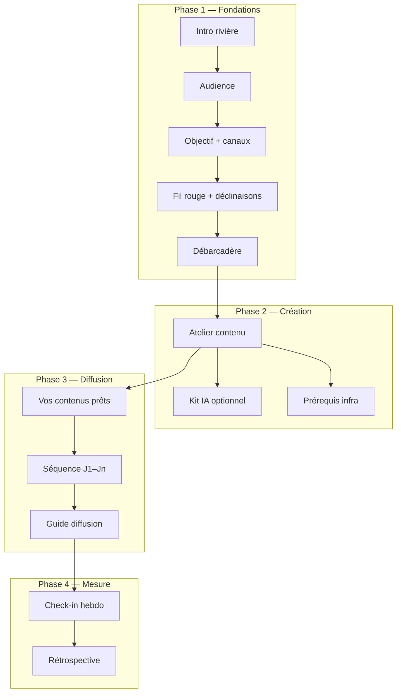

# Parcours utilisateur — Atelier création de contenu (phase Création)

> Document produit — juin 2026  
> Module **Campagne** · Phase 2 sur 4 : **Création**  
> Public : fondateurs, PM, recette QA, onboarding équipe

---

## 1. Promesse produit

Après avoir posé les **Fondations** (audience, objectif, fil rouge message), la phase **Création** guide la rédaction concrète des contenus nécessaires à la diffusion :

- **Landing** (H1, sous-titre, bullets, CTA)
- **Canal principal** choisi en Fondations (SEO, Google Ads, Meta, TikTok, LinkedIn, cold email, recommandation…)
- **Premier canal support** (ex. SEO + Recommandation)

Ce n’est **pas** un CMS ni un outil ads intégré : c’est un **copilote d’exécution** — textes pré-remplis depuis le fil rouge, ajustables, copiables vers vos outils (Webflow, Google Ads, Meta Business, etc.).

Sous-titre affiché dans l’UI : **« On fabrique vos contenus »**.

---

## 2. Vue d’ensemble du parcours campagne



---

## 3. Prérequis pour accéder à l’atelier

| Condition | Détail |
|-----------|--------|
| Fondations terminées | `foundationsRiver.completedAt` — validation du **débarcadère** |
| Données disponibles | Audience (`who`, `pain`), objectif, canaux, fil rouge / `messageAdaptations` |
| Module | Cockpit → **Campagne** → onglet phase **Création** (ou CTA « Passer à la création » depuis le débarcadère) |

**Au moment de valider le débarcadère**, l’application **pré-calcule et enregistre** les brouillons de contenu (`contentAssets` dérivés, non confirmés). L’atelier s’ouvre donc avec les champs déjà remplis.

---

## 4. Parcours détaillé — Phase Création

### 4.1 Entrée dans l’écran

1. L’utilisateur arrive sur **Création** (stepper phase 2, ou bouton du débarcadère Fondations).
2. En haut : **gaps** éventuels (« Site / landing : valider le contenu », etc.) — cliquables pour scroller vers l’asset concerné.
3. Bloc principal : **« Vos contenus prêts à publier »** (`#creation-content-studio`).
4. En dessous (repliable) : **« Aller plus loin avec l’IA »** (kit campagne — **non bloquant**).
5. Prérequis **infra** (tracking, CRM, etc.) — requis pour la **Diffusion**, pas pour valider les contenus.

### 4.2 Structure de l’atelier

L’atelier suit une **rivière** : **1 étape = 1 asset**.

Ordre par défaut :

1. **Site / landing** (`landing`)
2. **Canal principal** (ex. `seo`, `google`, `meta`…)
3. **Canal support** (1er canal support ≠ principal, ex. `referral`)

Barre de progression : **« X/3 contenus validés »** + extrait du fil rouge.

Chaque étape affiche :

| Élément | Comportement |
|---------|--------------|
| Champs | Label humain, valeur pré-remplie, compteur `{n}/{max}` |
| **Copier** | Par champ et **Copier tout** (markdown) |
| **Ajuster** | Passe les champs en édition (textarea / input) |
| **C'est prêt** | Valide l’asset, enregistre, passe à l’étape suivante |
| Badge **Validé** | Asset confirmé (`confirmedAt` + champs valides) |

### 4.3 Contenu par canal (V1)

| Asset | Champs principaux | Limites clés |
|-------|-------------------|--------------|
| Landing | H1, sous-titre, 3 bullets, CTA | H1 ≤ 60 car. |
| SEO | Meta title, meta description, titre article, angle, plan H2 | Meta desc ≤ 160 |
| Google Ads | 3 titres, 2 descriptions, URL hint | Titres ≤ 30, desc ≤ 90 |
| Meta Ads | Texte principal, headline, description, CTA | Selon schéma |
| TikTok | Hook 3 s, script 15 s, texte écran, légende | Hook ≤ 2 lignes |
| Recommandation | Message de demande, relance, incitation | — |
| LinkedIn | Accroche, corps, CTA | — |
| Cold email | Objet, corps, PS | — |

Les textes initiaux viennent du **fil rouge** et des **déclinaisons canal** validées en Fondations. Règles de génération : phrases complètes, pas de tiret cadratin (—), H1 avec majuscule initiale.

### 4.4 Validation « C'est prêt »

Au clic :

1. Validation locale (champs requis, longueurs max).
2. Si erreur → message sous l’étape (ex. « Meta title : requis »).
3. Si OK → persistance portfolio (`setCampaignContentAsset`, `confirmed: true`).
4. Passage automatique à l’asset suivant.
5. Quand **tous** les assets requis sont confirmés → `contentStudio.completedAt` + bouton **« Continuer → Diffusion »**.

### 4.5 Critère de complétion phase Création

**Critère principal (parcours rivière)** : tous les assets requis ont un `confirmedAt` et passent la validation schéma.

**Fallback legacy** (projets antérieurs) :

- Kit IA généré **ou**
- Checklist assets ≥ 2 cases cochées

Les projets legacy avec checklist/kit mais sans atelier voient un badge **« Contenus non détaillés »** invitant à passer par l’atelier.

### 4.6 Kit IA (optionnel)

Section repliable **« Aller plus loin avec l’IA »** :

- Génère prompts / briefs pour outils externes (Builder tier).
- Si des contenus sont déjà validés → section **« Vos contenus validés »** + le prompt IA les intègre comme contraintes (variantes complémentaires, pas de contradiction).
- **Ne bloque pas** la complétion de la phase Création.

---

## 5. Parcours — Handoff vers Diffusion

Une fois la Création complète **et** les prérequis infra satisfaits (tracking, contenus prêts, CRM si outbound…) :

### 5.1 Encart « Vos contenus prêts »

- Liste des assets **confirmés** en Création.
- Bouton **Copier** par asset (bloc markdown).
- Aperçu de la 1re accroche (H1, hook, headline…).

### 5.2 Guide diffusion

- Étapes checklist par canal (Meta, Google, SEO…).
- **Accroche validée** injectée depuis `contentAssets` (plus le positioning brut seul).

### 5.3 Séquence & UTM

- Séquence J1–Jn cochable.
- URL UTM campagne copiable.
- Connecteurs (Plausible, HubSpot…) selon motion GTM.

---

## 6. Parcours — Retour Fondations → Message

Sur la carte **Message** (Fondations) :

- Si l’atelier a démarré : mention « contenus préparés · voir l’atelier Création ».
- Débarcadère : **« Prochaine étape : fabriquer vos contenus (landing + …) »** + CTA **Passer à la création**.

---

## 7. Cas particuliers & rétrocompatibilité

| Situation | Comportement |
|-----------|--------------|
| Projet sans `contentAssets` | Dérivation à l’affichage ; pas d’erreur |
| Checklist legacy cochée | Phase Création peut être « complète » en legacy ; badge invitation atelier |
| Kit existant | Conservé ; coexiste avec l’atelier |
| Rechargement page | Assets persistés ; étapes déjà « Validé » restent validées |
| Édition après validation | « Ajuster » + re-clic « C'est prêt » |

---

## 8. Navigation & ancres UI

| Ancre | Usage |
|-------|--------|
| `creation-content-studio` | Atelier principal |
| `creation-asset-landing` | Étape landing |
| `creation-asset-{canal}` | Étape canal (ex. `creation-asset-seo`) |
| `creation-kit` | Kit IA (legacy / optionnel) |
| `creation-assets` | Checklist legacy |
| `infra-gates` | Prérequis infra |
| `diffusion-screen` | Phase Diffusion |

Les **blockers** du header readiness (« Validez vos contenus… ») et le gate **« Contenus prêts »** pointent vers `creation-content-studio`.

---

## 9. Données persistées (`campaignSetup`)

```ts
contentAssets?: Record<string, CampaignContentAsset>;
contentStudio?: {
  startedAt?: string;      // 1er accès atelier / dock
  completedAt?: string;    // tous assets requis confirmés
  lastEditedAssetId?: string;
};
```

Chaque `CampaignContentAsset` :

- `id`, `channel`, `label`, `fields[]`, `source` (`derived` | `edited` | `ai`)
- `confirmedAt`, `updatedAt`, `schemaVersion`

Legacy conservé : `assetChecklist`, `messageAdaptations`, `kitsByTool`.

---

## 10. Recette manuelle (checklist QA)

- [ ] Après Fondations, Création affiche **landing + 2 canaux** pré-remplis
- [ ] Chaque champ : compteur, copier, texte crédible (pas de troncature « entre »)
- [ ] Landing H1 : **majuscule** initiale, **pas de —**
- [ ] Google : titres ≤ 30 car., descriptions ≤ 90
- [ ] Meta / TikTok : scripts exploitables
- [ ] « C'est prêt » × 3 → phase Création complète **sans** checklist
- [ ] Diffusion : encart contenus confirmés + accroche guide
- [ ] Diffusion accessible **sans kit IA** si atelier complet + infra OK
- [ ] Projet legacy sans `contentAssets` : pas d’erreur
- [ ] Rechargement : validations conservées
- [ ] Header blocker → scroll atelier

---

## 11. Hors périmètre V1 (non-objectifs)

- Publication directe vers Google / Meta / TikTok APIs
- Génération visuelle, upload média
- Éditeur WYSIWYG landing
- Variantes A/B, localisation EN
- Refonte complète Diffusion / Mesure (hors encart contenus + accroche guide)

Points d’extension documentés dans `src/lib/campaign/content-schemas.ts` (nouveaux canaux, IA par champ, score qualité, preview landing, push H1 vers Build…).

---

## 12. Fichiers techniques de référence

| Domaine | Fichiers |
|---------|----------|
| Schémas canal | `src/lib/campaign/content-schemas.ts` |
| Dérivation | `src/lib/campaign/content-derive.ts` |
| Constantes V1 | `src/lib/campaign/content-constants.ts` |
| Complétion phase | `src/lib/campaign/phases.ts` |
| Gate créas | `src/lib/campaign/infra-gates.ts` |
| Persistance | `src/lib/portfolio.ts` |
| UI atelier | `src/components/cockpit/campaign/campaign-content-studio.tsx` |
| Écran Création | `src/components/cockpit/campaign/campaign-creation-screen.tsx` |
| Tests | `scripts/campaign-content-*.test.ts` |

---

## Documents associés

| Document | Contenu |
|----------|---------|
| [campagne-parcours-utilisateur.md](./campagne-parcours-utilisateur.md) | Parcours complet onglet Campagne (4 phases) |
| [campagne-cadrage-produit.md](./campagne-cadrage-produit.md) | Cadrage technique et architecture |

---

*Dernière mise à jour : juin 2026 — aligné sur l’implémentation atelier contenu V1.*
