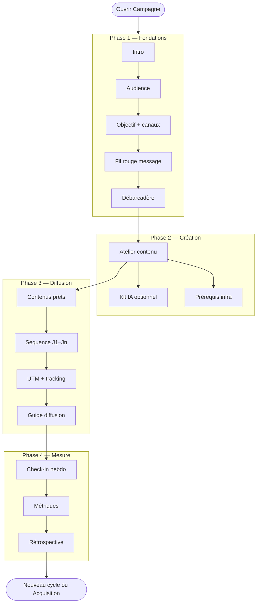
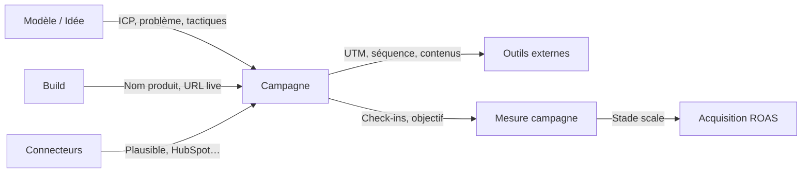

# Parcours utilisateur — Onglet Campagne

> Document produit · juin 2026  
> Module cockpit **Campagne** (`/cockpit/[id]?module=campagne`)  
> Public : fondateurs, PM, support, recette QA

---

## Table des matières

1. [À quoi sert l’onglet Campagne](#1-à-quoi-sert-longlet-campagne)
2. [Comment y accéder](#2-comment-y-accéder)
3. [Structure de l’écran](#3-structure-de-lécran)
4. [Vue d’ensemble du parcours](#4-vue-densemble-du-parcours)
5. [Phase 1 — Fondations](#5-phase-1--fondations)
6. [Phase 2 — Création](#6-phase-2--création)
7. [Phase 3 — Diffusion](#7-phase-3--diffusion)
8. [Phase 4 — Mesure](#8-phase-4--mesure)
9. [Règles de progression entre phases](#9-règles-de-progression-entre-phases)
10. [Prérequis infra (gates)](#10-prérequis-infra-gates)
11. [Navigation, gaps et blockers](#11-navigation-gaps-et-blockers)
12. [Lien avec les autres modules](#12-lien-avec-les-autres-modules)
13. [Cas particuliers et rétrocompatibilité](#13-cas-particuliers-et-rétrocompatibilité)
14. [Checklist recette manuelle](#14-checklist-recette-manuelle)

**Approfondissement phase Création (atelier contenu)** : [campagne-parcours-creation-contenu.md](./campagne-parcours-creation-contenu.md)

---

## 1. À quoi sert l’onglet Campagne

L’onglet **Campagne** est le copilote go-to-market du cockpit. Il répond à la question :

> *« Comment je lance et j’itère ma campagne d’acquisition, étape par étape ? »*

Il **orchestr**e des outils externes (Google Ads, Meta, Lemlist, CMS…) et **guide** un parcours en **4 phases linéaires** :

| Phase | Intention utilisateur |
|-------|------------------------|
| **Fondations** | Poser qui on cible, l’objectif, le canal et le message |
| **Création** | Fabriquer les contenus concrets (landing, ads, SEO…) |
| **Diffusion** | Exécuter la séquence de lancement canal par canal |
| **Mesure** | Suivre les résultats, check-in hebdo, clôturer le cycle |

Ce n’est **pas** :

- le module **Acquisition** (ROAS, funnel, dépenses ads) ;
- le module **Build** (construction produit) ;
- un outil de publication directe vers Google / Meta / TikTok.

---

## 2. Comment y accéder

1. Ouvrir le **cockpit** d’un projet (`/cockpit/[projectId]`).
2. Cliquer **Campagne** dans la barre latérale (groupe Projet).
3. URL directe : `/cockpit/[projectId]?module=campagne`.

**Prérequis implicites**

- Projet lié à une **idée / opportunité** (données marché, ICP, problème client).
- Recommandé : produit **nommé** dans Build pour des copies plus précises.
- L’app peut être en préparation ; un bandeau rappelle si elle n’est pas encore en ligne.

---

## 3. Structure de l’écran

De haut en bas, l’utilisateur voit toujours la même ossature :

```
┌─────────────────────────────────────────────────────────┐
│  Bandeau Build (si app pas live)                        │
├─────────────────────────────────────────────────────────┤
│  En-tête campagne (readiness, objectif, blockers)       │
├─────────────────────────────────────────────────────────┤
│  Stepper 4 phases : Fondations │ Création │ Diffusion │ Mesure │
├─────────────────────────────────────────────────────────┤
│  Contenu de la phase active                             │
└─────────────────────────────────────────────────────────┘
```

### En-tête campagne

- **Focus semaine** et motion GTM (founder-led, outbound, content, paid test…).
- **Score readiness** (% de critères remplis).
- **Puces vertes** : ce qui est OK (stratégie, contenus, tracking…).
- **Puces ambre cliquables** : blockers → scroll vers la section concernée.

### Stepper (4 phases)

- Barre **Progression : X/4 phases**.
- Onglets cliquables si la phase est **débloquée**.
- Phases **verrouillées** affichent la raison (ex. « Validez vos contenus »).
- La phase **courante** est déterminée automatiquement selon l’avancement réel.

---

## 4. Vue d’ensemble du parcours



**Fil conducteur produit** : chaque phase **alimente** la suivante avec des données persistées (ICP, canaux, message, contenus, séquence, check-ins).

---

## 5. Phase 1 — Fondations

**Objectif utilisateur** : *« Je sais pour qui je fais quoi, avec quel message, sur quels canaux. »*

La Fondations est une **rivière guidée** en 5 arrêts. Une barre de progression (Audience → Objectif → Message) apparaît après l’intro.

### 5.1 Intro

- Texte contextualisé (nom produit, cible opportunité).
- CTA **Commencer** → démarre la rivière (`foundationsRiver.startedAt`).

### 5.2 Audience

- Proposition **Qui** et **Problème** dérivés de la fiche idée.
- L’utilisateur peut **Ajuster** (ICP structuré) ou **Confirmer**.
- À la confirmation : `audienceConfirmedAt`.

### 5.3 Objectif et canaux

- **Stratégies** proposées selon le stade (ex. confiance SEO + recommandation, accélération SEA…).
- Choix du **canal principal** + **canal support**.
- Pas de chiffres exposés brutalement : approche narrative (ex. « Construire la confiance avant d’accélérer »).
- Confirmation : objectif SMART, canal, motion GTM, profil marketing.
- `goalConfirmedAt`, `goalStrategyId`, `supportChannelKeys`.

### 5.4 Message (fil rouge)

- **Fil rouge** : phrase de positionnement principale.
- **Déclinaisons canal** : preview « Comment ça sonnera » (landing, SEO, ads…).
- L’utilisateur confirme le message et les adaptations.
- `messageConfirmedAt`, `messageAdaptations` persistées.

### 5.5 Débarcadère (récap)

- Récap **Audience · Objectif · Message · Canaux**.
- Ligne **Prochaine étape** : fabriquer les contenus (landing + canaux).
- CTA **Passer à la création**.

**À la validation du débarcadère** :

- Fondations marquées complètes (`foundationsRiver.completedAt`).
- **Pré-calcul** des brouillons de contenu pour la phase Création (`contentAssets` dérivés, non confirmés).

### Complétion phase Fondations

Fondations = complète quand le débarcadère est validé (parcours rivière) **ou** données legacy suffisantes (brief + positioning / ICP).

---

## 6. Phase 2 — Création

**Objectif utilisateur** : *« J’ai des textes prêts à coller dans mes outils. »*

Sous-titre affiché : **« On fabrique vos contenus »**.

### 6.1 Atelier contenu (parcours principal)

Visible dès que les Fondations sont terminées.

**3 contenus typiques** (selon canaux choisis) :

1. **Site / landing** — H1, sous-titre, 3 points clés, CTA  
2. **Canal principal** — ex. SEO, Google Ads, Meta, TikTok, LinkedIn, cold email  
3. **Canal support** — ex. recommandation  

Pour chaque contenu :

| Action | Effet |
|--------|--------|
| Lire les champs pré-remplis | Texte issu du fil rouge Fondations |
| **Copier** / **Copier tout** | Export vers CMS, Ads Manager, etc. |
| **Ajuster** | Édition des champs (compteurs caractères) |
| **C'est prêt** | Validation + passage à l’étape suivante |

Quand **tous** les contenus requis sont validés → bouton **Continuer → Diffusion**.

→ Détail complet : [campagne-parcours-creation-contenu.md](./campagne-parcours-creation-contenu.md)

### 6.2 Kit IA (optionnel, repliable)

- Section **« Aller plus loin avec l’IA »**.
- Génère prompts / briefs pour outils marketing (tier Builder).
- Peut s’appuyer sur les contenus déjà validés.
- **Ne bloque pas** la complétion de la phase si l’atelier est terminé.

### 6.3 Prérequis infra

Les prérequis techniques (tracking, CRM, app en ligne…) sont configurés en **phase Diffusion**, via des boutons d'action — pas de case à cocher en Création.

### Complétion phase Création

| Parcours | Critère |
|----------|---------|
| **Standard** | Tous les contenus atelier confirmés avec « C'est prêt » |

Le kit IA reste optionnel (section repliable « Aller plus loin avec l'IA »).

---

## 7. Phase 3 — Diffusion

**Objectif utilisateur** : *« Je lance concrètement sur mes canaux. »*

**Accès** : phase Création complète. Tout le reste se fait en Diffusion, guidé étape par étape avec « C'est fait ».

### 7.1 Vos contenus prêts

- Liste des assets **confirmés** en Création.
- Copie markdown par asset.
- Aperçu de l’accroche principale.

### 7.2 Séquence de lancement

- **Séquence J1–Jn** adaptée au canal.
- Bouton **C'est fait** sur chaque étape (pas de checkbox).
- Liens vers outils externes quand pertinent.

### 7.3 Tracking campagne

- **URL UTM** générée, copiable.
- Bouton **UTM enregistré — c'est fait**.

### 7.4 Guide diffusion

- Étapes par canal (Meta, Google, SEO, cold email…).
- **Accroche validée** injectée depuis les contenus Création.
- Bouton **C'est fait** sur chaque étape.

### 7.5 Connecteurs

- Bandeau connecteurs (Plausible, HubSpot…) selon stade et canal.

### Complétion phase Diffusion

- **Toutes** les étapes de la séquence validées avec « C'est fait » ;
- **Toutes** les étapes du guide diffusion validées ;
- Prérequis infra satisfaits (connecteurs ou confirmation guidée).

---

## 8. Phase 4 — Mesure

**Objectif utilisateur** : *« Je sais si ça marche et quoi changer. »*

### 8.1 Check-in hebdomadaire (action principale)

- Formulaire **2 min** : valeur métrique, notes, humeur (on track / bloqué / pivot).
- Rappel de cadence (« il est temps de faire le point »).
- Première soumission = phase Mesure considérée entamée.

### 8.2 Métriques

- Panneau métriques si données cockpit disponibles (signups, etc.).
- Comparé à l’objectif SMART défini en Fondations.

### 8.3 Analytics

- Connecteurs analytics (Plausible, PostHog, GA…).

### 8.4 Message-market fit (repliable)

- Verbatims prospects après calls.
- Liste cumulative de citations.

### 8.5 Rétrospective de cycle

- **Ce qui a marché · Ce qui a bloqué · Prochain changement**.
- Clôture le cycle (`cycleStatus: completed`).
- Option **Nouveau cycle** campagne.

### Handoff Acquisition

- Si stade **scale** : bouton **Ouvrir Acquisition (ROAS)** vers le pilotage ads/funnel.

---

## 9. Règles de progression entre phases

| De → Vers | Condition |
|-----------|-----------|
| → **Fondations** | Toujours accessible |
| → **Création** | Fondations complètes |
| → **Diffusion** | Création complète **+** gates infra requis OK |
| → **Mesure** | Au moins une étape diffusion entamée ou validée |

Le stepper **suggère** la phase courante ; l’utilisateur peut naviguer manuellement vers les phases déjà débloquées.

**Ordre canonique recommandé** : Fondations → Création → Diffusion → Mesure → (rétrospective) → nouveau cycle.

---

## 10. Prérequis infra (gates)

| Gate | Requis pour Diffusion | Comment le satisfaire |
|------|----------------------|------------------------|
| App / landing en ligne | Non | Build live ou validation manuelle |
| Tracking ou attribution | **Oui** | Plausible/PostHog/GA, UTM, ou question « Comment nous avez-vous connu ? » |
| CRM ou suivi prospects | Si outbound / founder-led | HubSpot/Pipedrive ou validation manuelle |
| Authentification email | Si outbound | SPF/DKIM ou validation manuelle |
| Contenus prêts | **Oui** | Atelier entièrement validé |

---

## 11. Navigation, gaps et blockers

### Gaps de phase

En haut de chaque écran, liste **« Il reste à faire »** avec liens cliquables :

| Phase | Exemples de gaps |
|-------|------------------|
| Fondations | « Confirmer pour qui c'est », « Valider le récapitulatif » |
| Création | « Site / landing : valider le contenu », « Google Ads : valider les annonces » |
| Diffusion | Prérequis infra, séquence |
| Mesure | « Faites votre check-in hebdomadaire » |

### Ancres UI (scroll)

| Ancre | Section |
|-------|---------|
| `foundations-screen` | Rivière Fondations |
| `foundations-audience` | Étape audience |
| `foundations-goal` | Étape objectif |
| `foundations-message` | Étape message |
| `foundations-dock` | Débarcadère |
| `creation-content-studio` | Atelier contenu |
| `creation-asset-{id}` | Étape contenu (landing, seo, google…) |
| `creation-kit` | Kit IA |
| `infra-gates` | Prérequis infra |
| `diffusion-screen` | Phase Diffusion |
| `diffusion-sequence` | Séquence |
| `measure-checkin` | Check-in |
| `measure-retro` | Rétrospective |

### Blockers en-tête → ancre

Les puces ambre du header (readiness) scrollent vers la section à compléter (Fondations, atelier, infra, Build…).

---

## 12. Lien avec les autres modules



| Module | Rôle dans le parcours Campagne |
|--------|--------------------------------|
| **Modèle / Idée** | Source audience, pain, canaux CAC |
| **Build** | Nom produit, URL prod, gate « app live » |
| **Connecteurs** | Tracking, CRM, analytics |
| **Acquisition** | Pilotage ROAS une fois le stade scale atteint |
| **LaunchPad** | Onboarding pré-cockpit ; distinct de Campagne |

---

## 13. Cas particuliers et rétrocompatibilité

| Situation | Comportement |
|-----------|--------------|
| Projet démarré avant la rivière Fondations | Données legacy (brief, ICP, positioning) peuvent suffire ; rivière proposée au prochain passage |
| Checklist assets (ancien mode) | Encore utilisable si pas de rivière ; badge « Ancien mode » |
| Kit généré sans atelier | Création considérée complète (legacy) ; badge « Contenus non détaillés » invite à l’atelier |
| App pas live | Parcours préparation possible ; bandeau rappel Build |
| Rechargement page | Progression persistée dans `campaignSetup` (portfolio) |
| Projet idée sans opportunité catalogue | Dépend du chargement catalogue ; opportunité passée depuis le cockpit |

---

## 14. Checklist recette manuelle

### Parcours nominal (rivière complète)

- [ ] Intro Fondations → 3 confirmations (audience, objectif, message)
- [ ] Débarcadère validé → passage Création automatique ou CTA
- [ ] Création : 3 contenus pré-remplis, « C'est prêt » × 3
- [ ] Gates infra OK (tracking minimum + contenus)
- [ ] Diffusion : contenus copiables, séquence, UTM, guide
- [ ] Mesure : check-in, rétrospective, option nouveau cycle

### Navigation

- [ ] Stepper reflète la phase courante
- [ ] Blockers header scrollent vers la bonne section
- [ ] Phases verrouillées affichent une raison claire

### Non-régression legacy

- [ ] Projet avec kit seul : Diffusion accessible si infra OK
- [ ] Parcours guidé : Fondations → atelier « C'est prêt » → Diffusion « C'est fait » → Mesure

---

## Documents associés

| Document | Contenu |
|----------|---------|
| [campagne-parcours-creation-contenu.md](./campagne-parcours-creation-contenu.md) | Atelier Création en détail (champs, canaux, persistance) |
| [campagne-cadrage-produit.md](./campagne-cadrage-produit.md) | Cadrage technique, architecture, API, phasing |

---

*Dernière mise à jour : juin 2026*
